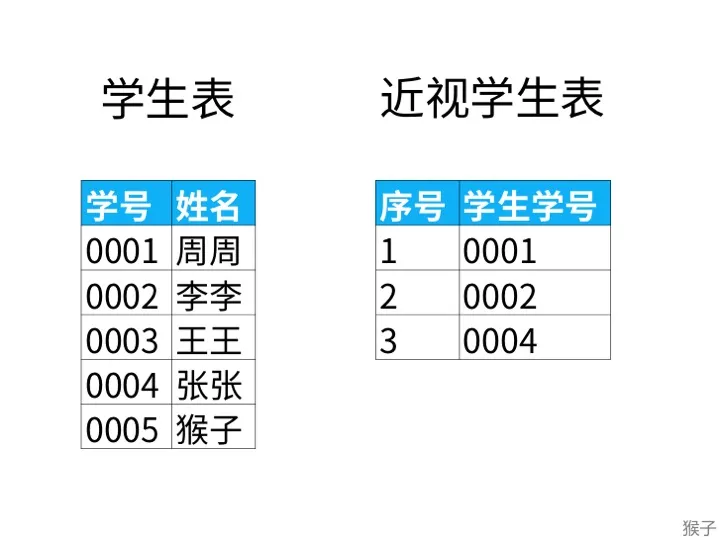
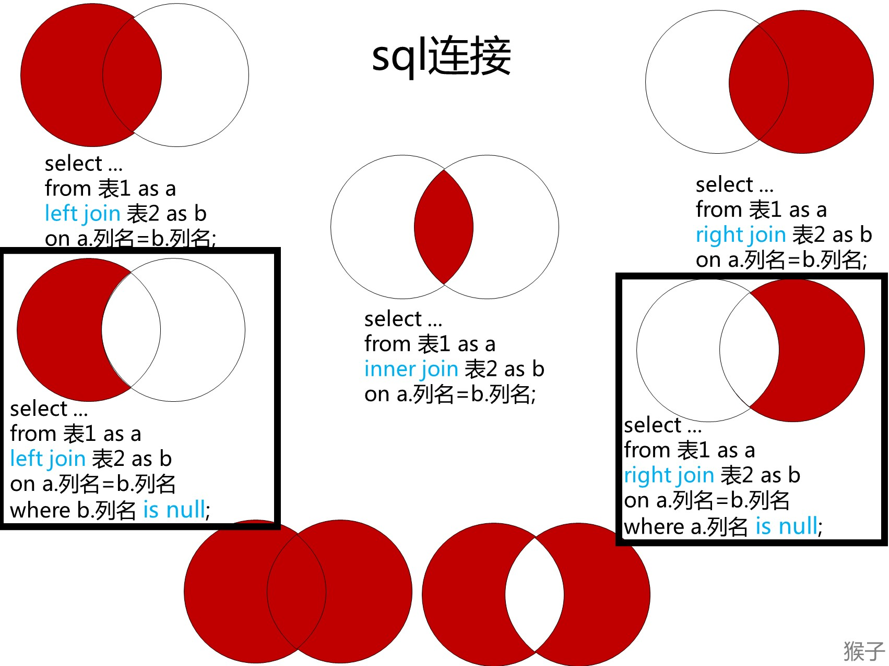

# [183\. 从不订购的客户](https://leetcode.cn/problems/customers-who-never-order/?envType=study-plan&id=sql-beginner&plan=sql&plan_progress=126t1tc)

## Description

Difficulty: **简单**

Related Topics: [数据库](https://leetcode.cn/tag/database/)

<a class="sql-schema-link__1VAC">SQL 架构</a>

某网站包含两个表，`Customers` 表和 `Orders` 表。编写一个 SQL 查询，找出所有从不订购任何东西的客户。

`Customers` 表：

```
+----+-------+
| Id | Name  |
+----+-------+
| 1  | Joe   |
| 2  | Henry |
| 3  | Sam   |
| 4  | Max   |
+----+-------+
```

`Orders` 表：

```
+----+------------+
| Id | CustomerId |
+----+------------+
| 1  | 3          |
| 2  | 1          |
+----+------------+
```

例如给定上述表格，你的查询应返回：

```
+-----------+
| Customers |
+-----------+
| Henry     |
| Max       |
+-----------+
```

## Solution

Language: **MySQL**

我的思考，这道题是有两个表，我以前一看到两个表的时候，我就头疼，现在也是。

我们需要将两个表的信息给连接起来，那么我们就需要用到 join

我们根据来个例子来理解一下：

下面是学生的名单，表名为“学生表”；近视学生的名单，表名为“近视学生表”。请问不是近视眼的学生都有谁？
（“学生表”表中的学号与“近视学生”表中的学生学号一一对应）


解题思路】

1.我们先来拆解问题：不是近视眼的学生都有谁？

1）“不是近视眼”的学生，近视信息在“近视学生”表里
2） “学生都有谁？”，要求的是“学生姓名”，所以我们的输出答案应该是“学生姓名”，这在“学生”表里。

涉及 2 张以上表的查询时，我们需要用到多表联结。

2.使用哪种联结呢？
在《从零学会 SQL：多表查询》这个课里我讲过各个联结的情况：


其中上图黑色框里的 sql 解决的问题是：不在表里的数据，也就是在表 A 里的数据，但是不在表 B 里的数据。

对于这个题目“不是近视眼的学生都有谁？”，就是在“学生表”里的数据，但是不在“近视学生”表里的数据。我们选择下图黑色框里的左联结 sql 语句。

```mysql
# Write your MySQL query statement below
select 
# 因为我们得到的列名需要是Customers
a.Name as Customers
from
# 这样我们左连接的时候就会比较方便
Customers as a
left join
# 这样我们左连接的是时候就会比较方便
Orders as b
on
# 连接条件
a.id = b.CustomerId
# 选择条件
where
b.CustomerId is null
;

# 参考题解
# https://leetcode.cn/problems/customers-who-never-order/solution/tu-jie-sqlmian-shi-ti-cha-zhao-bu-zai-biao-li-de-s/
```
