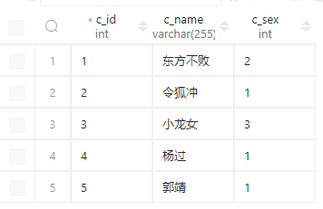
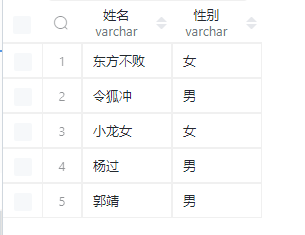
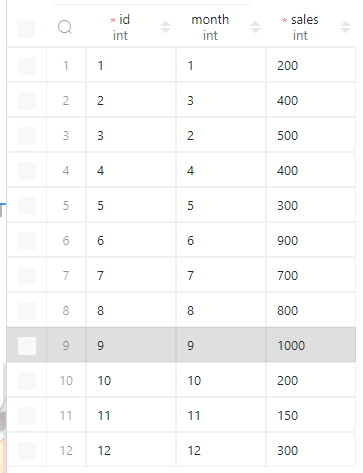

Case when 的用法: 一旦满足了某一个 WHEN, 则这一条数据就会退出 CASE WHEN , 而不再考虑 其他 CASE;

## 用法一（case 字段 when）

原来的表格



```sql
SELECT
    c_name as '姓名',
    case c_sex
        when 1 then '男'
        else '女'
    end as '性别'
FROM user_info;
```

上面这个代码的含义就是在 user_inof 这个表里面，当性别为 1 的时候就是男的，当性别为其他数字的话就是女的，然后修改这个列的名字原本是叫`c_sex`，然后我们也筛选姓名。

结果如下：



## 用法二（case when 字段）


```sql
SELECT
    c_name,
    case
        when c_sex = 1 then '男'
        else '女'
    end as '性别'
from user_info;
```


## 用法四（between）

我们现在的表格就是一个 `apple_sales`
表格如下：



然后，我想要统计一，二，三，四，季度的销量！

```sql
select
    case
        when month between 1 and 3 then '一'
        when month between 4 and 6 then '二'
        when month between 7 and 9 then '三'
        else '四'
    end as '季度',
    sum(sales) '销量'
from apple_sales
group by 季度
order by 季度;
```

从上面可以知道 between 并不是两个焦点，而是这两个点中间的值，包括这两个点！

当然我们得出了这个数据，想要让它显示好的话，还是需要使用 `group by 季度`

## 相关 sql 题目

- [1873.计算特殊奖金.sql](https://leetcode.cn/problems/calculate-special-bonus/)
