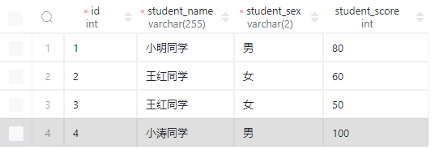
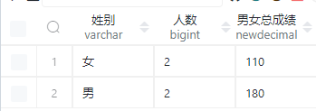
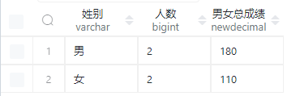

## group by

`group by 列名` 然后我们就会根据这个列名，想同的名字把他们分成同样的组！

### 示例

我们先创建这个表吧，毕竟没有数据怎么能实现东西呢！

```sql
DROP TABLE IF EXISTS `student_score`;

CREATE TABLE
    student_score(
        id int NOT NULL PRIMARY KEY AUTO_INCREMENT COMMENT 'Primary Key',
        student_name VARCHAR(255) NOT NULL COMMENT '学生姓名',
        student_sex VARCHAR(2) NOT NULL COMMENT '学生姓别',
        student_score int COMMENT '学生总成绩'
    ) COMMENT '学生成绩表（sql 学习）';

insert into
    student_score(
        student_name,
        student_sex,
        student_score
    )
values ('小明同学', '男', '80'), ('王红同学', '女', '60'), ('王红同学', '女', '50'), ('小涛同学', '男', '100');
```



现在我们有一个学生成绩表，然后有男女之分，
我现在想要把男的分成一组，女的分成一组，然后显示男女的成绩和人数。

```sql
SELECT
    student_sex as '姓别',
    count(*) as '人数',
    sum(student_score) as '男女成绩'
from student_score
GROUP BY 姓别;
```



## order by

我们看了上面的例子然后我们想要按照分数的高低进行排序，那么我们就用到了 `order by`

升序排序

`asc` **默认不写就是升序排序**

```sql
SELECT
    student_sex as '姓别',
    count(*) as '人数',
    sum(student_score) as '男女总成绩'
from student_score
GROUP BY 姓别
ORDER BY 男女总成绩 asc
;
```


降序排序

`desc`

```sql
SELECT
    student_sex as '姓别',
    count(*) as '人数',
    sum(student_score) as '男女总成绩'
from student_score
GROUP BY 姓别
ORDER BY 男女总成绩 desc
;
```


