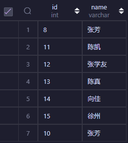
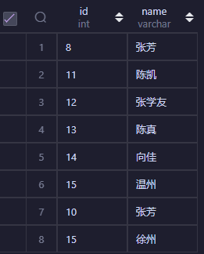
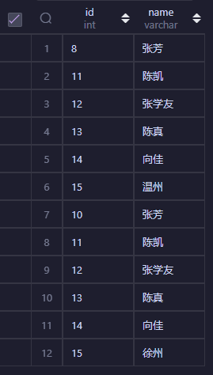

## 前言

我们在搜索的时候往往不是只查询一张表，就跟人干事，不能只给自己一条路一样，那么怎么能脚踩两只船呢？那就让我们来学习 mysql union 和 union all

## union

union：对两个结果集进行并集操作，不包括重复行，同时进行默认规则的排序；union 在进行表链接后会筛选掉重复的记录，所以在表链接后会对所产生的结果集进行排序运算，删除重复的记录再返回结果。实际大部分应用中是不会产生重复的记录，最常见的是过程表与历史表 union。
如下 sql：

让我们先创建表：

```sql
drop table if exists union_student_aa ;

create table
    union_student_aa(
        id int(20) not null primary key comment '学生 id',
        name varchar(255) not null comment '学生姓名'
    ) comment '学生表格 aa（union）';

insert into union_student_aa(id, name) values (10, '张芳');

insert into union_student_aa(id, name) values (11, '陈凯');

insert into union_student_aa(id, name) values (12, '张学友');

insert into union_student_aa(id, name) values (13, '陈真');

insert into union_student_aa(id, name) values (14, '向佳');

insert into union_student_aa(id, name) values (15, '徐州');

drop table if exists union_student_bb ;

create table
    union_student_bb(
        id int(20) not null primary key comment '学生 id',
        name varchar(255) not null comment '学生姓名'
    ) comment '学生表格 bb（union）';

insert into union_student_bb(id, name) values (8, '张芳');

insert into union_student_bb(id, name) values (11, '陈凯');

insert into union_student_bb(id, name) values (12, '张学友');

insert into union_student_bb(id, name) values (13, '陈真');

insert into union_student_bb(id, name) values (14, '向佳');

insert into union_student_bb(id, name) values (15, '徐州');
```

然后这个时候我们查询就会发现如果两个的其中一个值一样，就会返回 id 比较小的那个

```sql
SELECT id, name
from union_student_aa
union
SELECT id, name
from union_student_bb;
```

但是如果值是一样的，但是 id 是想等的话，那么会获得谁的数据就要看谁在后面了。



结果如下：

```sql
SELECT id, name
from union_student_bb
union
SELECT id, name
from union_student_aa;
```

结果如下：



## union all

还是上面的例子，但是这个时候，我用的就 union all 进行连接了。

```sql
SELECT id, name
FROM union_student_bb
UNION ALL
SELECT id, name
FROM union_student_aa;
```

结果如下：

## union 和 union all 区别

union 和 union all 的区别是，union 会自动压缩多个结果集合中的重复结果，而 union all 则将所有的结果全部显示出来，不管是不是重复。

```sql
SELECT id, name
FROM union_student_bb
UNION ALL
SELECT id, name
FROM union_student_aa;
```


