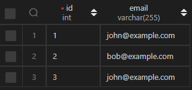
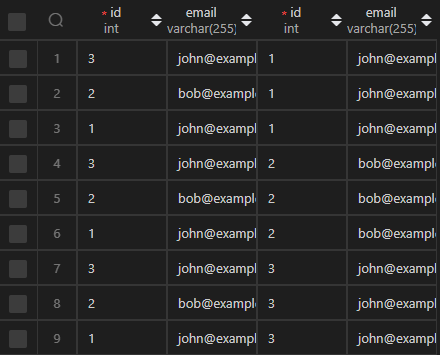
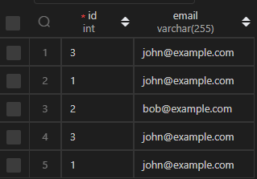

## 前言

在我们一些的查询的时候，我们是要比较这表里面的字段的。

## 例子

比如这个例子就需要使用这个了！

我们先创建表

```sql
DROP TABLE IF EXISTS Person
CREATE TABLE
    Person(
        id int NOT NULL PRIMARY KEY AUTO_INCREMENT COMMENT 'Primary Key',
        email VARCHAR(255) COMMENT '邮箱'
    ) COMMENT '人表 leetcode';

insert into Person (email)
VALUES ('john@example.com'), ('bob@example.com'), ('john@example.com');
```

创造好的表格如下：



如果我们要查看两个人邮箱，因为是要进行比较。

我们就看两个进行比较：

```sql
SELECT p1.*, p2.* FROM Person p1,Person p2;
```

结果如下：



那么我们想要查找两个邮箱相等的

```sql
SELECT p1.* FROM Person p1,Person p2 WHERE p1.email = p2.email ;
```



那么我们还想要查找 id 比较大的一方

```sql
SELECT p1.*
FROM Person p1, Person p2
WHERE
    p1.email = p2.email
    AND p1.id > p2.id;
```


